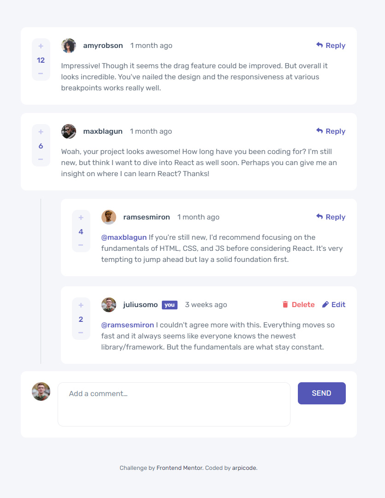

# Frontend Mentor - Interactive comments section solution

This is a solution to the [Interactive comments section challenge on Frontend Mentor](https://www.frontendmentor.io/challenges/interactive-comments-section-iG1RugEG9). Frontend Mentor challenges help you improve your coding skills by building realistic projects.

## Table of contents

-   [Overview](#overview)
    -   [The challenge](#the-challenge)
    -   [Screenshot](#screenshot)
    -   [Links](#links)
-   [My process](#my-process)
    -   [Built with](#built-with)
    -   [TODOs](#todos)
-   [Author](#author)
-   [Acknowledgments](#acknowledgments)

## Overview

### The challenge

Users should be able to:

-   View the optimal layout for the app depending on their device's screen size
-   See hover states for all interactive elements on the page
-   Create, Read, Update, and Delete comments and replies
-   Upvote and downvote comments
-   **Bonus**: If you're building a purely front-end project, use `localStorage` to save the current state in the browser that persists when the browser is refreshed.
-   **Bonus**: Instead of using the `createdAt` strings from the `data.json` file, try using timestamps and dynamically track the time since the comment or reply was posted.

### Screenshot

### Links

-   Solution URL: [View on GitHub](https://github.com/arpicode/interactive-comments-section)
-   Live Site URL: [View demo on Netlify](https://arpicode-interactive-comments-section.netlify.app/)

## My process

### Built with

-   Semantic HTML5 markup
-   SCSS for styles
-   Mobile-first workflow
-   Vanilla JS
-   Webpack 5

### TODOs

This is a first version that meets the requirements of the challenge + bonuses. I will probably continue working on some features:

-   Keyboard navigation for better accessibility
-   Finish animations (like when deleting a message)
-   Some refactoring

## Author

-   GitHub - [arpicode](https://github.com/arpicode)
-   Frontend Mentor - [@arpicode](https://www.frontendmentor.io/profile/arpicode)
